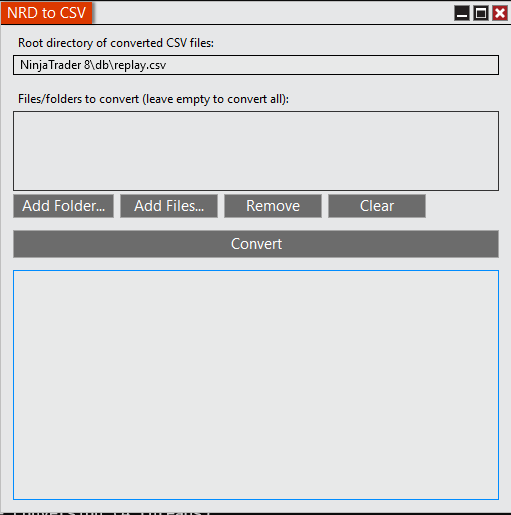

<div align="center">

<h3>NRDToCSV</h3>



</div>

#
**NinjaTrader 8** AddOn to convert NRD (`*.nrd`) market replay files to CSV (`*.csv`)<br>
(based on [not yet documented][market-data] `MarketReplay.DumpMarketDepth` feature)

## Quick Start

1. Download the latest **zip file** with AddOn from [Releases][releases]
2. Import AddOn into NinjaTrader 8 via `Tools` / `Import` / `NinjaScript Add-On...`
3. Open NRD to CSV tool via `Tools` / `NRD to CSV`
4. Press **Convert** button to convert all `*.nrd` replay files
5. Check `Documents` \ `NinjaTrader 8` \ `db` \ `replay.csv` folder with the results

## Selecting Files to Convert

You can select specific files or folders to convert using any of these methods:

### Using Buttons
- **Add Folder...** - Browse and select a folder containing `.nrd` files
- **Add Files...** - Browse and select individual `.nrd` files (multi-select supported)
- **Remove** - Remove selected items from the list
- **Clear** - Clear the entire list and output log

### Drag & Drop
Simply drag folders or `.nrd` files from Windows Explorer onto the file list.

### Convert All
Leave the file list empty to convert all `.nrd` files in the default replay folder.

## Progress & Cancellation

- Progress is shown immediately when conversion starts
- Displays: files completed, bytes processed, and estimated time remaining
- Click **Cancel** to stop conversion at any time (stops within seconds)
- After completion, click **Close** to exit or **Clear** to start a new batch

## Converted `*.csv` file format

### Content example
```csv
L1;0;20210120050050;2300000;1855.8;2
L1;1;20210120050107;2140000;1855.4;8
L2;0;20210120050000;70000;0;0;;1855.5;1
```

### L1 Records
- `NinjaTrader.Data.MarketDataType`
```csharp
Ask = 0
Bid = 1
Last = 2
DailyHigh = 3
DailyLow = 4
DailyVolume = 5
LastClose = 6
Opening = 7
OpenInterest = 8
Settlement = 9
Unknown = 10
```
- `Timestamp` in `YYYYMMDDhhmmss` format (local NinjaTrader timezone is used)
- `Timestamp offset` as an integer amount of 100-nanoseconds (`1e-7`)
- `Price` value (local NinjaTrader price format is used for thousand/decimal separators)
- `Volume` value

### L2 Records
- `NinjaTrader.Data.MarketDataType`
```csharp
Ask = 0
Bid = 1
Last = 2
DailyHigh = 3
DailyLow = 4
DailyVolume = 5
LastClose = 6
Opening = 7
OpenInterest = 8
Settlement = 9
Unknown = 10
```
- `Timestamp` in `YYYYMMDDhhmmss` format (local NinjaTrader timezone is used)
- `Timestamp offset` as an integer amount of 100-nanoseconds (`1e-7`)
- `NinjaTrader.Cbi.Operation`
```csharp
Add = 0
Update = 1
Remove = 2
```
- `Position` in Order Book
- `MarketMaker` identifier
- `Price` value (local NinjaTrader price format is used for thousand/decimal separators)
- `Volume` value

## Change Log
This project adheres to [Semantic Versioning][semver].<br>
Every release, along with the migration instructions, is documented on the GitHub [Releases][releases] page.

## License
The code is available under the [MIT license][license].

## Contacts
Feel free to contact me at **@gmail.com**: **eugene.ilyin**

[releases]: https://github.com/eugeneilyin/nrdtocsv/tree/main/Releases
[license]: /License.txt
[semver]: http://semver.org
[market-data]: https://ninjatrader.com/support/forum/forum/ninjatrader-8/platform-technical-support-aa/1067384-more-info-on-marketreplay-dumpmarketdata-marketreplay-dumpmarketdepth
